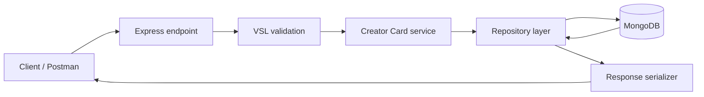

# Creator Card Microservice

[](https://github.com/SakshiS010/creator-card-microservice/actions/workflows/ci.yml)

A production-oriented REST API for creating and sharing creator profiles with links, service
rates, draft/published visibility, optional private access, and soft deletion.

This implementation follows the supplied Resilience17 Node.js template and keeps the required
endpoints at the root of the base URL—there is no `/api` or `/v1` prefix.

**Live API:** [https://creator-card-microservice-nj95.onrender.com](https://creator-card-microservice-nj95.onrender.com)

## Features

- Create public or private creator cards.
- Automatically generate readable, unique slugs.
- Publish cards or keep them unavailable as drafts.
- Protect private cards with six-character access codes.
- Store cards in MongoDB using ULID `_id` values.
- Expose `id`—never `_id`—in API responses.
- Hide `access_code` from every public retrieval response.
- Soft-delete cards while excluding them from later retrieval.
- Return the assessment's exact business error codes and HTTP statuses.
- Reject malformed JSON safely without crashing the process.

## Architecture



The request layers follow the template's structure:

```text
Request → Endpoint → Service/VSL → Repository → MongoDB → Serializer → Response
```

- **Endpoints** translate HTTP requests into service calls.
- **Services** contain validation, access control, slug generation, and business rules.
- **Repositories** perform MongoDB operations through the template factory.
- **Models** define database shape and indexes.
- **Serializers** map MongoDB `_id` to API `id` and remove protected fields.

More detail is available in [Design decisions](docs/design-decisions.md).

## Technology

- Node.js 22
- Express.js
- MongoDB and Mongoose
- Template VSL validator
- Mocha and Chai

## Getting Started

### Requirements

- Node.js 22
- npm
- MongoDB running locally or a MongoDB Atlas connection string

If you use `nvm`:

```bash
nvm use
```

Install dependencies:

```bash
npm ci
```

Create a local environment file:

```bash
cp .env.example .env
```

Set the required values:

```dotenv
PORT=8811
APP_NAME=Creator Card Microservice
MONGODB_URI=mongodb://127.0.0.1:27017/creator-cards
PINO_LOG_LEVEL=info
LOG_APP_REQUEST=0
CAN_LOG_ENDPOINT_INFORMATION=
```

Start the service:

```bash
node bootstrap.js
```

The local base URL is:

```text
http://localhost:8811
```

The root path intentionally returns `404`. Use one of the three API endpoints below.

## API Endpoints

| Method   | Path                   | Purpose                    |
| -------- | ---------------------- | -------------------------- |
| `POST`   | `/creator-cards`       | Create a creator card      |
| `GET`    | `/creator-cards/:slug` | Retrieve a published card  |
| `DELETE` | `/creator-cards/:slug` | Soft-delete a creator card |

No authentication header or API key is required by the assessment.

### Create a Creator Card

```http
POST /creator-cards
Content-Type: application/json
```

```json
{
  "title": "George Cooks",
  "description": "Weekly cooking podcast",
  "slug": "george-cooks",
  "creator_reference": "crt_8f2k1m9x4p7w3q5z",
  "links": [
    {
      "title": "YouTube",
      "url": "https://youtube.com/@georgecooks"
    }
  ],
  "service_rates": {
    "currency": "NGN",
    "rates": [
      {
        "name": "IG Story Post",
        "description": "One story mention",
        "amount": 5000000
      }
    ]
  },
  "status": "published",
  "access_type": "public"
}
```

Successful response: `HTTP 200`

```json
{
  "status": "success",
  "message": "Creator Card Created Successfully.",
  "data": {
    "id": "01KVNCMC3N5XWX7XQ66NRYVXF9",
    "title": "George Cooks",
    "description": "Weekly cooking podcast",
    "slug": "george-cooks",
    "creator_reference": "crt_8f2k1m9x4p7w3q5z",
    "links": [
      {
        "title": "YouTube",
        "url": "https://youtube.com/@georgecooks"
      }
    ],
    "service_rates": {
      "currency": "NGN",
      "rates": [
        {
          "name": "IG Story Post",
          "description": "One story mention",
          "amount": 5000000
        }
      ]
    },
    "status": "published",
    "access_type": "public",
    "access_code": null,
    "created": 1782055579765,
    "updated": 1782055579765,
    "deleted": null
  }
}
```

If `slug` is omitted, it is generated from the title. A collision or a generated slug shorter
than five characters receives a random six-character suffix.

### Retrieve a Card

Public card:

```http
GET /creator-cards/george-cooks
```

Private card:

```http
GET /creator-cards/vip-rate-card?access_code=A1B2C3
```

Successful response: `HTTP 200`

```json
{
  "status": "success",
  "message": "Creator Card Retrieved Successfully.",
  "data": {
    "id": "01KVNCMC3N5XWX7XQ66NRYVXF9",
    "title": "George Cooks",
    "slug": "george-cooks",
    "creator_reference": "crt_8f2k1m9x4p7w3q5z",
    "status": "published",
    "access_type": "public",
    "created": 1782055579765,
    "updated": 1782055579765,
    "deleted": null
  }
}
```

Retrieval responses never include `access_code`, even when the correct code was supplied.

Access checks run in this exact order:

1. Missing or deleted card → `NF01`
2. Draft card → `NF02`
3. Private card without an access code → `AC03`
4. Private card with an incorrect access code → `AC04`

### Delete a Card

```http
DELETE /creator-cards/george-cooks
Content-Type: application/json
```

```json
{
  "creator_reference": "crt_8f2k1m9x4p7w3q5z"
}
```

Successful response: `HTTP 200`

The response returns the deleted card, including its `access_code`, and sets `deleted` to a Unix
epoch timestamp. Later retrieval returns `NF01`.

## Validation Rules

| Field                    | Rules                                                                  |
| ------------------------ | ---------------------------------------------------------------------- |
| `title`                  | Required string, 3–100 characters                                      |
| `description`            | Optional string, maximum 500 characters                                |
| `slug`                   | Optional, 5–50 characters, letters/numbers/hyphens/underscores, unique |
| `creator_reference`      | Required string, exactly 20 characters                                 |
| `links`                  | Optional array                                                         |
| `links[].title`          | Required string, 1–100 characters                                      |
| `links[].url`            | Maximum 200 characters; starts with `http://` or `https://`            |
| `service_rates.currency` | `NGN`, `USD`, `GBP`, or `GHS`                                          |
| `service_rates.rates`    | Non-empty array when `service_rates` is present                        |
| `rates[].name`           | Required string, 3–100 characters                                      |
| `rates[].description`    | Required string, maximum 250 characters                                |
| `rates[].amount`         | Positive integer in minor currency units                               |
| `status`                 | Required: `draft` or `published`                                       |
| `access_type`            | Optional: `public` or `private`; defaults to `public`                  |
| `access_code`            | Exactly six alphanumeric characters; private cards only                |

Field-level validation uses the template's VSL validator and returns `HTTP 400`.

## Business Error Codes

| Code   | HTTP | Meaning                                 |
| ------ | ---: | --------------------------------------- |
| `SL02` |  400 | Client-provided slug is already taken   |
| `AC01` |  400 | Private card is missing `access_code`   |
| `AC05` |  400 | Public card supplied an `access_code`   |
| `NF01` |  404 | Card does not exist or has been deleted |
| `NF02` |  404 | Card exists but is still a draft        |
| `AC03` |  403 | Private card requires an access code    |
| `AC04` |  403 | Supplied access code is incorrect       |

Error envelope:

```json
{
  "status": "error",
  "message": "Slug is already taken",
  "code": "SL02"
}
```

## Testing and Quality Checks

Run the assignment and HTTP contract tests:

```bash
npm test
```

The suite contains named coverage for all 16 assessment scenarios plus malformed JSON, response
envelopes, nested validation, and protected-field serialization.

Run linting and formatting checks:

```bash
npm run lint
npm run format:check
```

Run the MongoDB integration suite against an isolated test database:

```bash
TEST_MONGODB_URI=mongodb://127.0.0.1:27017/creator-card-test \
  npm run test:integration
```

The integration tests drop the database named in `TEST_MONGODB_URI`; never point this command at
development or production data.

Check dependencies:

```bash
npm audit
```

At the time of submission preparation, the audit reports zero known vulnerabilities.

## Environment Variables

| Variable                       | Required    | Description                                           |
| ------------------------------ | ----------- | ----------------------------------------------------- |
| `MONGODB_URI`                  | Yes         | MongoDB connection URI                                |
| `PORT`                         | No          | HTTP port; defaults to `8811`                         |
| `APP_NAME`                     | Recommended | Application name used by template utilities           |
| `PINO_LOG_LEVEL`               | No          | Logger level such as `info` or `silent`               |
| `LOG_APP_REQUEST`              | No          | Set to `1` to log incoming requests                   |
| `CAN_LOG_ENDPOINT_INFORMATION` | No          | Use `1` to enable; leave blank to disable             |
| `NO_SINGLE_ERRORS`             | No          | Use `1` to enable; leave blank to disable             |
| `TOP_LEVEL_ERROR_MESSAGE`      | No          | Overrides the aggregated validation message           |
| `USE_SECRETS_MANAGER`          | No          | Use `1` to enable; leave blank to disable             |
| `SECRETS_MANAGER_ID`           | Conditional | AWS secret identifier when Secrets Manager is enabled |
| `AWS_ACCESS_KEY_ID`            | Conditional | AWS credential when Secrets Manager is enabled        |
| `AWS_SECRET_ACCESS_KEY`        | Conditional | AWS credential when Secrets Manager is enabled        |

Never commit `.env`, Atlas credentials, or deployment secrets.

## Project Structure

```text
endpoints/creator-card/       HTTP handlers
services/creator-card/        Validation and business logic
repository/creator-card/      MongoDB repository
models/creator-card.js        MongoDB schema and indexes
messages/creator-card.js      Business error messages
test/                         Unit, contract, and integration tests
docs/                         Design and development notes
```

## Additional Documentation

- [Design decisions](docs/design-decisions.md)
- [AI-assisted development and verification](docs/ai-assisted-development.md)
- [Postman collection and environments](postman/README.md)

## Deployment Contract

For assessment submission, deploy the service with a persistent MongoDB database and submit only
the base URL:

```text
https://creator-card-microservice-nj95.onrender.com
```

Do not submit `/creator-cards`, `/api`, `/v1`, or any other path suffix.
